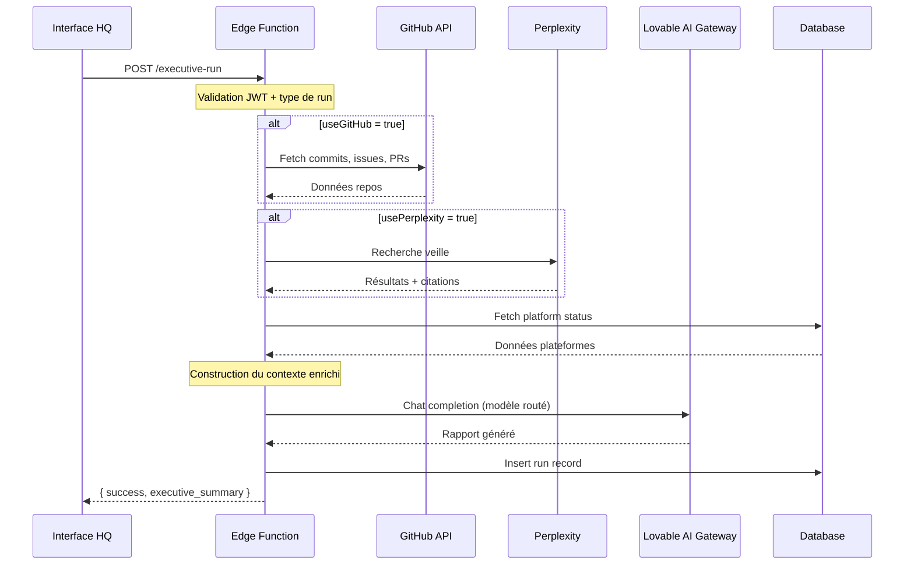

# Guide IA — EMOTIONSCARE HQ

> Documentation des modèles, prompts et workflows d'automatisation IA

---

## 🧠 Vue d'ensemble

Le HQ utilise une **architecture multi-modèles** pour optimiser chaque type de tâche:

```
┌─────────────────────────────────────────────────────────────┐
│                    LOVABLE AI GATEWAY                       │
│                 (Routeur de modèles unifié)                 │
├─────────────────────────────────────────────────────────────┤
│                                                              │
│  ┌──────────────┐  ┌──────────────┐  ┌──────────────┐       │
│  │   Gemini     │  │   GPT-5.2    │  │   Perplexity │       │
│  │   2.5 Pro    │  │   (Coding)   │  │   Sonar Pro  │       │
│  │  (Reasoning) │  │              │  │   (Search)   │       │
│  └──────────────┘  └──────────────┘  └──────────────┘       │
│                                                              │
└─────────────────────────────────────────────────────────────┘
```

---

## 🎯 Stratégie de routage des modèles

| Tâche | Modèle choisi | Justification |
|-------|---------------|---------------|
| **Raisonnement complexe** | `google/gemini-2.5-pro` | Capacité de raisonnement multi-étapes, long contexte |
| **Génération de code** | `openai/gpt-5.2` | Précision syntaxique, connaissance des frameworks |
| **Synthèses exécutives** | `google/gemini-2.5-flash` | Rapidité + qualité acceptable |
| **Tâches simples** | `google/gemini-3-flash-preview` | Faible latence, coût minimal |
| **Veille stratégique** | Perplexity `sonar-pro` | Recherche web temps réel avec citations |

### Configuration du routeur

```typescript
// supabase/functions/executive-run/index.ts
const MODEL_CONFIG = {
  default: "google/gemini-3-flash-preview",   // Tâches générales
  reasoning: "google/gemini-2.5-pro",          // Briefings, audits
  coding: "openai/gpt-5.2",                    // Code generation
  summary: "google/gemini-2.5-flash",          // Résumés rapides
};
```

---

## 📋 Types de Runs IA

### 1. DAILY_EXECUTIVE_BRIEF

**Objectif**: Briefing quotidien pour la Présidente

**Modèle**: `gemini-2.5-pro` (raisonnement)

**Sources de données**:
- ✅ GitHub API (commits, issues, PRs des 5 repos)
- ✅ Perplexity (veille marché SaaS France)
- ✅ Base de données (statut plateformes)

**System Prompt**:
```
Tu es le Directeur Général (CEO Agent) d'EMOTIONSCARE SASU, éditeur de 
logiciels applicatifs français de premier plan.

Tu génères le briefing exécutif quotidien pour la Présidente avec les 
données RÉELLES des systèmes.

Structure ton rapport ainsi:
1. 🎯 RÉSUMÉ EXÉCUTIF (3 phrases max, impact business)
2. 📊 STATUT RAG DES PLATEFORMES (basé sur GitHub + monitoring réels)
3. ⚡ TOP 3 PRIORITÉS DU JOUR
4. ⏳ DÉCISIONS EN ATTENTE D'APPROBATION
5. 🚨 ALERTES CRITIQUES (si applicable)
6. 📈 VEILLE STRATÉGIQUE (insights du marché)

Ton : professionnel, direct, factuel. Standard HEC/Polytechnique.
Ne jamais inventer de données - indique "Données non disponibles" si nécessaire.
```

**Exemple de sortie**:
```markdown
# 🎯 Briefing Exécutif — 3 février 2026

## Résumé Exécutif
Les 5 plateformes sont opérationnelles avec un uptime moyen de 99.2%.
Le MRR affiche une croissance de +8.2% ce mois. 
Une PR critique attend validation sur EmotionsCare.

## 📊 Statut RAG des Plateformes

| Plateforme | Status | Issues | PRs | Dernier Commit |
|------------|--------|--------|-----|----------------|
| EmotionsCare | 🟢 | 5 | 2 | 02/02 - feat: dashboard |
| Med MNG | 🟡 | 8 | 1 | 01/02 - fix: auth bug |
| ...

## ⚡ Top 3 Priorités
1. Valider PR #42 sur EmotionsCare (critique)
2. Résoudre 3 issues bloquantes sur Med MNG
3. Préparer release v2.1 de System Compass

## 📈 Veille Stratégique
Le marché SaaS santé français croît de 15% en 2026...
```

---

### 2. SECURITY_AUDIT_RLS

**Objectif**: Audit de sécurité Row Level Security

**Modèle**: `gemini-2.5-pro` (raisonnement rigoureux)

**Sources**: Perplexity (best practices sécurité)

**System Prompt**:
```
Tu es le CISO (Directeur Sécurité) effectuant un audit RLS complet.

Génère un rapport d'audit structuré:
1. 📋 TABLES ANALYSÉES
2. 🔒 POLITIQUES RLS en place
3. 🔴 VULNÉRABILITÉS potentielles détectées
4. ✅ CONFORMITÉ (OK/NOK par table)
5. 🛠️ RECOMMANDATIONS de remédiation prioritaires
6. 🎯 SCORE DE SÉCURITÉ GLOBAL (/100)

Adopte une approche rigoureuse et exhaustive de type audit Big4.
```

---

### 3. PLATFORM_STATUS_REVIEW

**Objectif**: Revue d'état d'une plateforme spécifique

**Modèle**: `gemini-2.5-flash` (synthèse rapide)

**Sources**: GitHub API (commits, issues, PRs du repo)

**Paramètre requis**: `platform_key`

---

### 4. MARKETING_WEEK_PLAN

**Objectif**: Planification marketing hebdomadaire

**Modèle**: `gemini-3-flash-preview` (créativité + rapidité)

**Sources**: Perplexity + Firecrawl (scraping concurrents)

---

### 5. COMPETITIVE_ANALYSIS

**Objectif**: Analyse concurrentielle approfondie

**Modèle**: `gemini-2.5-pro` (analyse stratégique)

**Sources**: Perplexity + Firecrawl

---

### 6. RELEASE_GATE_CHECK

**Objectif**: Validation Go/No-Go pour une release

**Modèle**: `gemini-2.5-pro` (décision critique)

**Sources**: GitHub API (PRs, tests, issues)

---

## 🔄 Workflow d'exécution d'un Run



---

## 🔧 Configuration des prompts

### Principes de conception

1. **Persona claire**: Chaque prompt définit un rôle précis (CEO, CISO, CMO...)
2. **Structure imposée**: Format de sortie explicite avec sections numérotées
3. **Données réelles obligatoires**: Interdiction d'inventer, mention explicite des données manquantes
4. **Standard qualité**: Référence "HEC/Polytechnique" pour le niveau d'exigence

### Variables dynamiques

Les prompts utilisent des variables injectées au runtime:

| Variable | Description | Exemple |
|----------|-------------|---------|
| `{{date}}` | Date/heure courante formatée | "lundi 3 février 2026, 14h30" |
| `{{platform_key}}` | Clé plateforme ciblée | "emotionscare" |
| `{{github_data}}` | Données GitHub collectées | Commits, issues, PRs |
| `{{perplexity_data}}` | Résultats de veille | Insights + citations |
| `{{context_data}}` | Contexte personnalisé | JSON libre |

---

## 📊 Monitoring et logs

### Logs Edge Function

```typescript
console.log(`[Executive Run] Starting ${run_type}`);
console.log(`[Executive Run] Fetching GitHub data...`);
console.log(`[Executive Run] Calling AI model: ${model}`);
console.log(`[Executive Run] AI response: ${response.length} chars`);
console.log(`[Executive Run] Completed with sources: ${sources.join(", ")}`);
```

### Métriques collectées

| Métrique | Description |
|----------|-------------|
| `run_type` | Type de run exécuté |
| `model_used` | Modèle IA utilisé |
| `data_sources` | Sources de données consultées |
| `execution_time_ms` | Temps d'exécution total |
| `tokens_used` | Tokens consommés (estimation) |

---

## ⚠️ Gestion des erreurs

### Erreurs IA Gateway

| Code | Message | Action |
|------|---------|--------|
| `429` | Rate limit | Retry avec backoff exponentiel |
| `402` | Crédits insuffisants | Notification admin |
| `500` | Erreur modèle | Fallback vers modèle alternatif |

### Fallback automatique

```typescript
// Si gemini-2.5-pro échoue, fallback vers flash
const fallbackModels = {
  "google/gemini-2.5-pro": "google/gemini-2.5-flash",
  "openai/gpt-5.2": "google/gemini-2.5-pro",
};
```

---

## 🎛️ Configuration avancée

### Paramètres de génération

```typescript
{
  model: "google/gemini-2.5-pro",
  temperature: 0.7,        // Créativité modérée
  max_tokens: 3000,        // Limite de sortie
  top_p: 0.9,              // Nucleus sampling
}
```

### Personnalisation par run type

| Run Type | Temperature | Max Tokens | Focus |
|----------|-------------|------------|-------|
| DAILY_EXECUTIVE_BRIEF | 0.7 | 3000 | Synthèse équilibrée |
| SECURITY_AUDIT_RLS | 0.3 | 4000 | Précision maximale |
| MARKETING_WEEK_PLAN | 0.8 | 2500 | Créativité |
| COMPETITIVE_ANALYSIS | 0.5 | 3500 | Analyse rigoureuse |

---

## 🔐 Sécurité IA

### Principes appliqués

1. **Pas de PII dans les prompts**: Les données personnelles ne sont jamais envoyées aux modèles
2. **Validation des sorties**: Sanitization avant stockage en DB
3. **Audit trail**: Chaque run est loggé avec son contexte
4. **Rate limiting**: Protection contre l'abus

### Secrets nécessaires

| Secret | Obligatoire | Description |
|--------|-------------|-------------|
| `LOVABLE_API_KEY` | ✅ | Accès au Gateway IA |
| `PERPLEXITY_API_KEY` | ❌ | Veille stratégique (fallback gracieux) |
| `GITHUB_TOKEN` | ❌ | Données repos (fallback gracieux) |

---

## 📈 Évolutions prévues

### Court terme
- [ ] Streaming des réponses IA
- [ ] Cache des requêtes Perplexity
- [ ] Métriques de coût par run

### Moyen terme
- [ ] Fine-tuning sur données EMOTIONSCARE
- [ ] Agents autonomes avec validation
- [ ] Intégration vision (analyse screenshots)

---

*Dernière mise à jour: 03/02/2026 — v1.0*
