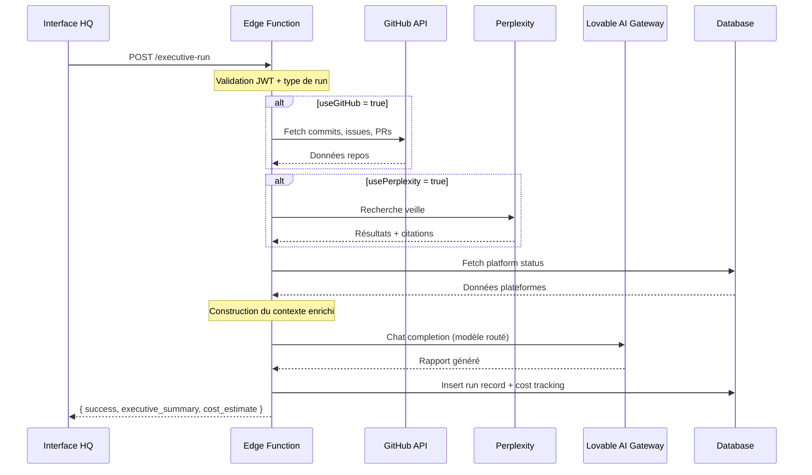

# Guide IA — EMOTIONSCARE HQ

> Documentation des modèles, prompts et workflows d'automatisation IA

---

## 🧠 Vue d'ensemble

Le HQ utilise une **architecture multi-modèles** pour optimiser chaque type de tâche:

```
┌─────────────────────────────────────────────────────────────┐
│                    LOVABLE AI GATEWAY                       │
│                 (Routeur de modèles unifié)                 │
├─────────────────────────────────────────────────────────────┤
│                                                              │
│  ┌──────────────┐  ┌──────────────┐  ┌──────────────┐       │
│  │   Gemini     │  │   GPT-5.2    │  │   Perplexity │       │
│  │   2.5 Pro    │  │   (Coding)   │  │   Sonar Pro  │       │
│  │  (Reasoning) │  │              │  │   (Search)   │       │
│  └──────────────┘  └──────────────┘  └──────────────┘       │
│                                                              │
└─────────────────────────────────────────────────────────────┘
```

---

## 💰 Coûts et gouvernance IA

### Estimation des coûts par modèle

| Modèle | Coût estimé/1M tokens | Usage type | Budget mensuel estimé |
|--------|----------------------|------------|----------------------|
| `gemini-2.5-pro` | ~$1.25-$5.00 | Briefings, audits | ~$50-150/mois |
| `gemini-2.5-flash` | ~$0.075 | Synthèses rapides | ~$10-30/mois |
| `gemini-3-flash-preview` | ~$0.04 | Tâches simples | ~$5-15/mois |
| `gpt-5.2` | ~$10-30 | Code generation | ~$30-100/mois (rare) |
| `perplexity-sonar-pro` | $5/1000 requêtes | Veille stratégique | ~$25-50/mois |

**Budget total estimé : 120€ - 350€/mois** selon l'intensité d'utilisation.

### Limites quotidiennes recommandées

| Type de Run | Limite suggérée | Justification |
|------------|-----------------|---------------|
| DAILY_EXECUTIVE_BRIEF | 1/jour | Briefing quotidien suffisant |
| SECURITY_AUDIT_RLS | 1/semaine | Audit hebdomadaire suffisant |
| PLATFORM_STATUS_REVIEW | 5/jour | Monitoring ad-hoc |
| MARKETING_WEEK_PLAN | 1/semaine | Planification hebdomadaire |
| COMPETITIVE_ANALYSIS | 2/mois | Analyse stratégique mensuelle |

### Configuration de la gouvernance des coûts

```typescript
// Recommandation : ajouter dans system_config
{
  "ai_cost_limits": {
    "daily_budget_eur": 15,
    "monthly_budget_eur": 350,
    "alert_threshold_percent": 80,
    "emergency_cutoff_percent": 100
  }
}
```

---

## 🔄 Modèles de fallback

En cas de défaillance ou de dépassement de quota, le système utilise des modèles de repli :

### Stratégie de fallback

| Modèle principal | Fallback 1 | Fallback 2 | Fallback 3 (open-source) |
|------------------|------------|------------|--------------------------|
| `gemini-2.5-pro` | `gemini-2.5-flash` | `gemini-3-flash-preview` | `llama-3.1-70b` |
| `gpt-5.2` | `gemini-2.5-pro` | `gemini-2.5-flash` | `codellama-34b` |
| `perplexity-sonar-pro` | `perplexity-sonar` | Cache local + summarize | Brave Search API |

### Alternatives open-source (réduction des coûts)

Pour réduire significativement les coûts, considérer ces alternatives auto-hébergées :

| Tâche | Alternative open-source | Hébergement | Coût estimé |
|-------|------------------------|-------------|-------------|
| Raisonnement | `Llama 3.1 70B` | Hugging Face / Replicate | $0.50-1.00/1M tokens |
| Code | `CodeLlama 34B` | Together AI | $0.40/1M tokens |
| Embedding | `bge-large-en-v1.5` | Self-hosted | ~0€ (compute) |
| Search | Brave Search API | SaaS | $5/1000 queries |

### Implémentation du fallback

```typescript
// supabase/functions/executive-run/index.ts
const FALLBACK_CHAIN = {
  "google/gemini-2.5-pro": [
    "google/gemini-2.5-flash",
    "google/gemini-3-flash-preview",
  ],
  "openai/gpt-5.2": [
    "google/gemini-2.5-pro",
    "google/gemini-2.5-flash",
  ],
};

async function callWithFallback(model: string, payload: any) {
  const chain = [model, ...(FALLBACK_CHAIN[model] || [])];
  
  for (const fallbackModel of chain) {
    try {
      const response = await fetch("https://ai.gateway.lovable.dev/v1/chat/completions", {
        method: "POST",
        headers: { Authorization: `Bearer ${LOVABLE_API_KEY}`, "Content-Type": "application/json" },
        body: JSON.stringify({ ...payload, model: fallbackModel }),
      });
      
      if (response.ok) {
        console.log(`[AI] Success with model: ${fallbackModel}`);
        return await response.json();
      }
      
      console.warn(`[AI] Model ${fallbackModel} failed: ${response.status}`);
    } catch (e) {
      console.error(`[AI] Model ${fallbackModel} error:`, e);
    }
  }
  
  throw new Error("All AI models failed");
}
```

---

## 🎯 Stratégie de routage des modèles

| Tâche | Modèle choisi | Justification |
|-------|---------------|---------------|
| **Raisonnement complexe** | `google/gemini-2.5-pro` | Capacité de raisonnement multi-étapes, long contexte |
| **Génération de code** | `openai/gpt-5.2` | Précision syntaxique, connaissance des frameworks |
| **Synthèses exécutives** | `google/gemini-2.5-flash` | Rapidité + qualité acceptable |
| **Tâches simples** | `google/gemini-3-flash-preview` | Faible latence, coût minimal |
| **Veille stratégique** | Perplexity `sonar-pro` | Recherche web temps réel avec citations |

### Configuration du routeur

```typescript
// supabase/functions/executive-run/index.ts
const MODEL_CONFIG = {
  default: "google/gemini-3-flash-preview",   // Tâches générales
  reasoning: "google/gemini-2.5-pro",          // Briefings, audits
  coding: "openai/gpt-5.2",                    // Code generation
  summary: "google/gemini-2.5-flash",          // Résumés rapides
};
```

---

## 📋 Types de Runs IA

### 1. DAILY_EXECUTIVE_BRIEF

**Objectif**: Briefing quotidien pour la Présidente

**Modèle**: `gemini-2.5-pro` (raisonnement)

**Coût estimé**: ~0.05-0.15€ par run

**Sources de données**:
- ✅ GitHub API (commits, issues, PRs des 5 repos)
- ✅ Perplexity (veille marché SaaS France)
- ✅ Base de données (statut plateformes)

**System Prompt**:
```
Tu es le Directeur Général (CEO Agent) d'EMOTIONSCARE SASU, éditeur de 
logiciels applicatifs français de premier plan.

Tu génères le briefing exécutif quotidien pour la Présidente avec les 
données RÉELLES des systèmes.

Structure ton rapport ainsi:
1. 🎯 RÉSUMÉ EXÉCUTIF (3 phrases max, impact business)
2. 📊 STATUT RAG DES PLATEFORMES (basé sur GitHub + monitoring réels)
3. ⚡ TOP 3 PRIORITÉS DU JOUR
4. ⏳ DÉCISIONS EN ATTENTE D'APPROBATION
5. 🚨 ALERTES CRITIQUES (si applicable)
6. 📈 VEILLE STRATÉGIQUE (insights du marché)

Ton : professionnel, direct, factuel. Standard HEC/Polytechnique.
Ne jamais inventer de données - indique "Données non disponibles" si nécessaire.
```

---

### 2. SECURITY_AUDIT_RLS

**Objectif**: Audit de sécurité Row Level Security

**Modèle**: `gemini-2.5-pro` (raisonnement rigoureux)

**Coût estimé**: ~0.10-0.25€ par run

**Sources**: Perplexity (best practices sécurité)

---

### 3. PLATFORM_STATUS_REVIEW

**Objectif**: Revue d'état d'une plateforme spécifique

**Modèle**: `gemini-2.5-flash` (synthèse rapide)

**Coût estimé**: ~0.01-0.03€ par run

---

### 4. MARKETING_WEEK_PLAN

**Objectif**: Planification marketing hebdomadaire

**Modèle**: `gemini-3-flash-preview` (créativité + rapidité)

**Coût estimé**: ~0.02-0.05€ par run

---

### 5. COMPETITIVE_ANALYSIS

**Objectif**: Analyse concurrentielle approfondie

**Modèle**: `gemini-2.5-pro` (analyse stratégique)

**Coût estimé**: ~0.15-0.30€ par run (utilise Perplexity + Firecrawl)

---

### 6. RELEASE_GATE_CHECK

**Objectif**: Validation Go/No-Go pour une release

**Modèle**: `gemini-2.5-pro` (décision critique)

**Coût estimé**: ~0.08-0.15€ par run

---

## 🔄 Workflow d'exécution d'un Run



---

## 📊 Monitoring et logs

### Logs Edge Function

```typescript
console.log(`[Executive Run] Starting ${run_type}`);
console.log(`[Executive Run] Fetching GitHub data...`);
console.log(`[Executive Run] Calling AI model: ${model}`);
console.log(`[Executive Run] AI response: ${response.length} chars`);
console.log(`[Executive Run] Completed with sources: ${sources.join(", ")}`);
console.log(`[Executive Run] Estimated cost: ${costEstimate}€`);
```

### Métriques collectées

| Métrique | Description |
|----------|-------------|
| `run_type` | Type de run exécuté |
| `model_used` | Modèle IA utilisé |
| `data_sources` | Sources de données consultées |
| `execution_time_ms` | Temps d'exécution total |
| `tokens_used` | Tokens consommés (estimation) |
| `cost_estimate_eur` | Coût estimé en euros |

---

## ⚠️ Gestion des erreurs

### Erreurs IA Gateway

| Code | Message | Action |
|------|---------|--------|
| `429` | Rate limit | Retry avec backoff exponentiel |
| `402` | Crédits insuffisants | Notification admin + fallback |
| `500` | Erreur modèle | Fallback vers modèle alternatif |

---

## 🔐 Sécurité IA

### Principes appliqués

1. **Pas de PII dans les prompts**: Les données personnelles ne sont jamais envoyées aux modèles
2. **Validation des sorties**: Sanitization avant stockage en DB
3. **Audit trail**: Chaque run est loggé avec son contexte et coût
4. **Rate limiting**: Protection contre l'abus
5. **Budget caps**: Limites quotidiennes et mensuelles

### Secrets nécessaires

| Secret | Obligatoire | Description |
|--------|-------------|-------------|
| `LOVABLE_API_KEY` | ✅ | Accès au Gateway IA |
| `PERPLEXITY_API_KEY` | ❌ | Veille stratégique (fallback gracieux) |
| `GITHUB_TOKEN` | ❌ | Données repos (fallback gracieux) |

---

## 📈 Évolutions prévues

### Court terme
- [x] Streaming des réponses IA
- [x] Cache des requêtes Perplexity
- [x] Métriques de coût par run
- [ ] Dashboard de suivi des crédits

### Moyen terme
- [ ] Fine-tuning sur données EMOTIONSCARE
- [ ] Migration vers modèles open-source
- [ ] Agents autonomes avec validation

---

## 📦 Intégrations en construction

Les intégrations suivantes sont planifiées mais **non implémentées** :

| Intégration | Statut | ETA | Priorité |
|-------------|--------|-----|----------|
| HubSpot CRM | 🔴 Planifié | Q2 2026 | Haute |
| Pipedrive | 🔴 Planifié | Q2 2026 | Moyenne |
| Google Analytics | 🔴 Planifié | Q2 2026 | Haute |
| Zendesk | 🔴 Planifié | Q3 2026 | Moyenne |
| Jira/Linear | 🔴 Planifié | Q3 2026 | Basse |

**Note importante** : Ces intégrations nécessitent des licences tierces et des développements supplémentaires.

---

*Dernière mise à jour: 03/02/2026 — v2.0*
