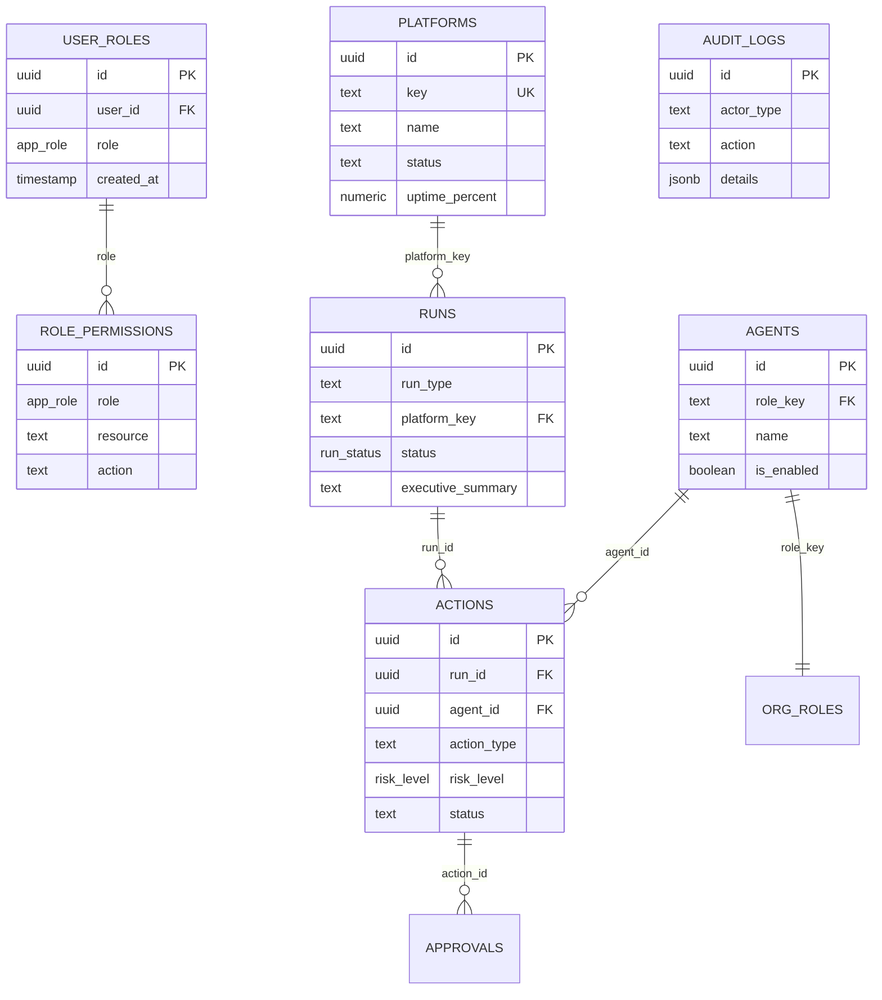

# Schéma Base de Données — EMOTIONSCARE HQ

> Documentation des tables, relations, politiques RLS et fonctions

---

## 📊 Vue d'ensemble des schémas

```
┌─────────────────────────────────────────────────────────────┐
│                      PostgreSQL                              │
├─────────────────────────────────────────────────────────────┤
│                                                              │
│  ┌──────────────┐  ┌──────────────┐  ┌──────────────┐       │
│  │    public    │  │      hq      │  │     auth     │       │
│  │   (RBAC)     │  │  (Données    │  │  (Supabase   │       │
│  │              │  │   métier)    │  │   managed)   │       │
│  └──────────────┘  └──────────────┘  └──────────────┘       │
│                                                              │
└─────────────────────────────────────────────────────────────┘
```

| Schéma | Accès | Description |
|--------|-------|-------------|
| `public` | Client + RPC | Rôles, permissions, fonctions utilitaires |
| `hq` | RPC uniquement | Données métier HQ (runs, agents, plateformes) |
| `auth` | Supabase | Authentification (géré automatiquement) |

---

## 🏗️ Schéma `public`

### Table: `user_roles`

Stocke les rôles attribués aux utilisateurs.

```sql
CREATE TABLE public.user_roles (
  id UUID PRIMARY KEY DEFAULT gen_random_uuid(),
  user_id UUID NOT NULL,          -- Référence auth.users(id)
  role app_role NOT NULL,         -- Enum des rôles
  created_at TIMESTAMPTZ DEFAULT now(),
  UNIQUE (user_id, role)          -- Un utilisateur ne peut avoir chaque rôle qu'une fois
);
```

**Colonnes**:
| Colonne | Type | Nullable | Description |
|---------|------|----------|-------------|
| `id` | UUID | Non | Clé primaire |
| `user_id` | UUID | Non | ID utilisateur (auth.users) |
| `role` | app_role | Non | Rôle attribué |
| `created_at` | TIMESTAMPTZ | Non | Date d'attribution |

**Index**:
- `user_roles_user_id_idx` sur `user_id`
- Contrainte unique sur `(user_id, role)`

**RLS Policies**:
```sql
-- Seul l'owner peut gérer les rôles
CREATE POLICY "Owner peut gérer les rôles" ON public.user_roles
  FOR ALL USING (is_owner());

-- L'owner peut voir les rôles  
CREATE POLICY "Owner peut voir les rôles" ON public.user_roles
  FOR SELECT USING (is_owner());
```

---

### Table: `role_permissions`

Définit les permissions par rôle (RBAC granulaire).

```sql
CREATE TABLE public.role_permissions (
  id UUID PRIMARY KEY DEFAULT gen_random_uuid(),
  role app_role NOT NULL,
  resource TEXT NOT NULL,         -- Ex: "finance", "marketing"
  action TEXT NOT NULL,           -- Ex: "view", "edit", "delete"
  created_at TIMESTAMPTZ DEFAULT now()
);
```

**Colonnes**:
| Colonne | Type | Nullable | Description |
|---------|------|----------|-------------|
| `id` | UUID | Non | Clé primaire |
| `role` | app_role | Non | Rôle concerné |
| `resource` | TEXT | Non | Ressource/module |
| `action` | TEXT | Non | Action autorisée |
| `created_at` | TIMESTAMPTZ | Non | Date de création |

**Exemples de permissions**:
```sql
INSERT INTO role_permissions (role, resource, action) VALUES
  ('finance', 'finance', 'view'),
  ('finance', 'finance', 'edit'),
  ('marketing', 'marketing', 'view'),
  ('marketing', 'marketing', 'edit'),
  ('viewer', 'all', 'view');
```

---

### Enum: `app_role`

```sql
CREATE TYPE public.app_role AS ENUM (
  'owner',       -- Accès complet (Présidente)
  'admin',       -- Administration
  'finance',     -- Module Finance
  'marketing',   -- Module Marketing
  'support',     -- Module Support
  'product',     -- Module Produit
  'engineering', -- Module Engineering
  'viewer'       -- Lecture seule
);
```

---

## 🏗️ Schéma `hq`

> ⚠️ Accès via RPC uniquement (fonctions `SECURITY DEFINER`)

### Table: `hq.platforms`

Les 5 plateformes managées.

```sql
CREATE TABLE hq.platforms (
  id UUID PRIMARY KEY DEFAULT gen_random_uuid(),
  key TEXT UNIQUE NOT NULL,       -- Ex: "emotionscare"
  name TEXT NOT NULL,             -- Ex: "EmotionsCare"
  description TEXT,
  github_url TEXT,
  status TEXT DEFAULT 'production', -- production, prototype, maintenance
  status_reason TEXT,
  uptime_percent NUMERIC(5,2) DEFAULT 99.9,
  last_release_at TIMESTAMPTZ,
  created_at TIMESTAMPTZ DEFAULT now(),
  updated_at TIMESTAMPTZ DEFAULT now()
);
```

**Données initiales**:
```sql
INSERT INTO hq.platforms (key, name, github_url) VALUES
  ('emotionscare', 'EmotionsCare', 'https://github.com/laeticiamng/emotionscare'),
  ('pixel-perfect-replica', 'Pixel Perfect Replica', 'https://github.com/laeticiamng/pixel-perfect-replica'),
  ('system-compass', 'System Compass', 'https://github.com/laeticiamng/system-compass'),
  ('growth-copilot', 'Growth Copilot', 'https://github.com/laeticiamng/growth-copilot'),
  ('med-mng', 'Med MNG', 'https://github.com/laeticiamng/med-mng');
```

---

### Table: `hq.runs`

Historique des exécutions IA.

```sql
CREATE TABLE hq.runs (
  id UUID PRIMARY KEY DEFAULT gen_random_uuid(),
  run_type TEXT NOT NULL,         -- Ex: "DAILY_EXECUTIVE_BRIEF"
  owner_requested BOOLEAN DEFAULT true,
  platform_key TEXT REFERENCES hq.platforms(key),
  director_agent_id UUID REFERENCES hq.agents(id),
  status hq.run_status DEFAULT 'pending',
  started_at TIMESTAMPTZ,
  completed_at TIMESTAMPTZ,
  executive_summary TEXT,
  detailed_appendix JSONB,
  created_at TIMESTAMPTZ DEFAULT now()
);
```

**Enum `run_status`**:
```sql
CREATE TYPE hq.run_status AS ENUM (
  'pending',
  'running',
  'completed',
  'failed',
  'cancelled'
);
```

---

### Table: `hq.agents`

Les 21 agents IA de l'équipe exécutive.

```sql
CREATE TABLE hq.agents (
  id UUID PRIMARY KEY DEFAULT gen_random_uuid(),
  role_key TEXT REFERENCES hq.org_roles(key),
  name TEXT NOT NULL,             -- Ex: "Agent CEO"
  is_enabled BOOLEAN DEFAULT true,
  model_preference TEXT DEFAULT 'auto',
  created_at TIMESTAMPTZ DEFAULT now(),
  updated_at TIMESTAMPTZ DEFAULT now()
);
```

---

### Table: `hq.org_roles`

Définition des rôles organisationnels.

```sql
CREATE TABLE hq.org_roles (
  id UUID PRIMARY KEY DEFAULT gen_random_uuid(),
  key TEXT UNIQUE NOT NULL,       -- Ex: "ceo", "cto"
  title TEXT NOT NULL,            -- Ex: "Chief Executive Officer"
  title_fr TEXT NOT NULL,         -- Ex: "Directeur Général"
  category TEXT NOT NULL,         -- c-suite, manager, gm
  description TEXT,
  created_at TIMESTAMPTZ DEFAULT now()
);
```

**Catégories**:
| Catégorie | Rôles |
|-----------|-------|
| `c-suite` | CEO, COO, CTO, CFO, CMO, CISO, CPO, CDO, CRO, CLO |
| `manager` | Engineering, QA, Design, Data, Support, People |
| `gm` | GM par plateforme (5) |

---

### Table: `hq.actions`

Actions proposées en attente d'approbation.

```sql
CREATE TABLE hq.actions (
  id UUID PRIMARY KEY DEFAULT gen_random_uuid(),
  run_id UUID REFERENCES hq.runs(id),
  agent_id UUID REFERENCES hq.agents(id),
  action_type TEXT NOT NULL,
  title TEXT NOT NULL,
  description TEXT,
  payload JSONB,
  risk_level hq.risk_level DEFAULT 'low',
  requires_approval BOOLEAN DEFAULT true,
  status TEXT DEFAULT 'pending',  -- pending, approved, rejected, executed
  created_at TIMESTAMPTZ DEFAULT now(),
  executed_at TIMESTAMPTZ
);
```

**Enum `risk_level`**:
```sql
CREATE TYPE hq.risk_level AS ENUM ('low', 'medium', 'high', 'critical');
```

---

### Table: `hq.approvals`

Historique des décisions d'approbation.

```sql
CREATE TABLE hq.approvals (
  id UUID PRIMARY KEY DEFAULT gen_random_uuid(),
  action_id UUID REFERENCES hq.actions(id),
  owner_id UUID NOT NULL,
  decision TEXT NOT NULL,         -- approved, rejected
  reason TEXT,
  created_at TIMESTAMPTZ DEFAULT now()
);
```

---

### Table: `hq.audit_logs`

Journal d'audit immuable.

```sql
CREATE TABLE hq.audit_logs (
  id UUID PRIMARY KEY DEFAULT gen_random_uuid(),
  actor_type TEXT NOT NULL,       -- owner, agent, system
  actor_id TEXT NOT NULL,
  action TEXT NOT NULL,           -- run.created, config.updated, etc.
  resource_type TEXT NOT NULL,
  resource_id TEXT,
  details JSONB,
  ip_address INET,
  created_at TIMESTAMPTZ DEFAULT now()
);
```

---

### Table: `hq.system_config`

Configuration système (autopilot, scheduler...).

```sql
CREATE TABLE hq.system_config (
  key TEXT PRIMARY KEY,
  value JSONB NOT NULL,
  description TEXT,
  updated_at TIMESTAMPTZ DEFAULT now()
);
```

**Clés de configuration**:
```sql
INSERT INTO hq.system_config (key, value) VALUES
  ('autopilot_enabled', 'false'),
  ('scheduler_config', '{"timezone": "Europe/Paris", "daily_brief_time": "08:00"}'),
  ('notification_channels', '["email", "in_app"]');
```

---

## 🔒 Fonctions RPC (SECURITY DEFINER)

Toutes les fonctions accédant au schéma `hq` utilisent `SECURITY DEFINER` pour contourner RLS et validant `is_owner()`.

### Fonctions utilitaires

```sql
-- Vérifie si l'utilisateur courant est owner
CREATE FUNCTION public.is_owner() RETURNS BOOLEAN AS $$
  SELECT public.has_role(auth.uid(), 'owner')
$$ LANGUAGE SQL STABLE SECURITY DEFINER;

-- Vérifie si un utilisateur a un rôle
CREATE FUNCTION public.has_role(_user_id UUID, _role app_role) RETURNS BOOLEAN AS $$
  SELECT EXISTS (
    SELECT 1 FROM public.user_roles
    WHERE user_id = _user_id AND role = _role
  )
$$ LANGUAGE SQL STABLE SECURITY DEFINER;

-- Vérifie une permission granulaire
CREATE FUNCTION public.has_permission(_user_id UUID, _resource TEXT, _action TEXT) 
RETURNS BOOLEAN AS $$
BEGIN
  IF public.has_role(_user_id, 'owner') THEN RETURN TRUE; END IF;
  RETURN EXISTS (
    SELECT 1 FROM public.user_roles ur
    JOIN public.role_permissions rp ON ur.role = rp.role
    WHERE ur.user_id = _user_id 
      AND rp.resource = _resource 
      AND rp.action = _action
  );
END;
$$ LANGUAGE plpgsql STABLE SECURITY DEFINER;
```

### Fonctions de lecture HQ

```sql
-- Récupère les runs récents
CREATE FUNCTION public.get_hq_recent_runs(limit_count INT DEFAULT 10)
RETURNS TABLE(...) AS $$
BEGIN
  IF NOT public.is_owner() THEN
    RAISE EXCEPTION 'Accès non autorisé';
  END IF;
  RETURN QUERY SELECT ... FROM hq.runs ORDER BY created_at DESC LIMIT limit_count;
END;
$$ LANGUAGE plpgsql SECURITY DEFINER SET search_path = public, hq;

-- Récupère les actions en attente
CREATE FUNCTION public.get_hq_pending_actions()
RETURNS TABLE(...) AS $$
BEGIN
  IF NOT public.is_owner() THEN
    RAISE EXCEPTION 'Accès non autorisé';
  END IF;
  RETURN QUERY SELECT ... FROM hq.actions 
    WHERE status = 'pending' AND requires_approval = true;
END;
$$ LANGUAGE plpgsql SECURITY DEFINER SET search_path = public, hq;
```

### Fonctions d'écriture HQ

```sql
-- Crée un nouveau run
CREATE FUNCTION public.insert_hq_run(
  p_run_type TEXT,
  p_platform_key TEXT DEFAULT NULL,
  p_owner_requested BOOLEAN DEFAULT true,
  p_status TEXT DEFAULT 'completed',
  p_executive_summary TEXT DEFAULT NULL,
  p_detailed_appendix JSONB DEFAULT NULL
) RETURNS UUID AS $$
DECLARE new_id UUID;
BEGIN
  IF NOT public.is_owner() THEN
    RAISE EXCEPTION 'Accès non autorisé';
  END IF;
  
  INSERT INTO hq.runs (...) VALUES (...) RETURNING id INTO new_id;
  
  -- Audit log
  INSERT INTO hq.audit_logs (actor_type, actor_id, action, resource_type, resource_id, details)
  VALUES ('owner', auth.uid()::TEXT, 'run.created', 'run', new_id::TEXT, 
          jsonb_build_object('run_type', p_run_type));
  
  RETURN new_id;
END;
$$ LANGUAGE plpgsql SECURITY DEFINER SET search_path = public, hq;

-- Approuve/rejette une action
CREATE FUNCTION public.approve_hq_action(
  p_action_id UUID, 
  p_decision TEXT, 
  p_reason TEXT DEFAULT NULL
) RETURNS BOOLEAN AS $$
BEGIN
  IF NOT public.is_owner() THEN
    RAISE EXCEPTION 'Accès non autorisé';
  END IF;
  
  UPDATE hq.actions SET status = p_decision WHERE id = p_action_id;
  INSERT INTO hq.approvals (action_id, owner_id, decision, reason)
    VALUES (p_action_id, auth.uid(), p_decision, p_reason);
  
  -- Audit log
  INSERT INTO hq.audit_logs (...) VALUES (...);
  
  RETURN TRUE;
END;
$$ LANGUAGE plpgsql SECURITY DEFINER SET search_path = public, hq;
```

---

## 🔐 Stratégie RLS

### Principes

1. **Schéma `public`**: RLS activé, policies basées sur `is_owner()`
2. **Schéma `hq`**: RLS activé mais accès uniquement via RPC `SECURITY DEFINER`
3. **Validation systématique**: Chaque fonction RPC vérifie `is_owner()` en premier

### Pourquoi SECURITY DEFINER ?

Le schéma `hq` n'est pas accessible directement par le client Supabase. Les fonctions RPC avec `SECURITY DEFINER`:
- S'exécutent avec les privilèges du créateur (superuser)
- Contournent les restrictions RLS
- Valident manuellement les permissions

```sql
-- Cette approche évite les problèmes de récursion RLS
-- et centralise la logique d'autorisation
SET search_path = public, hq;  -- Permet l'accès au schéma hq
```

---

## 📈 Diagramme ER



---

## 🔄 Migrations

Les migrations sont gérées automatiquement par Lovable Cloud et stockées dans `supabase/migrations/`.

### Convention de nommage
```
YYYYMMDDHHMMSS_<uuid>.sql
```

### Exemple de migration
```sql
-- 20260203164355_3c2f06b0-9c43-458c-90ca-74b13f79f44c.sql

-- Extension de l'enum app_role
ALTER TYPE public.app_role ADD VALUE IF NOT EXISTS 'finance';
ALTER TYPE public.app_role ADD VALUE IF NOT EXISTS 'marketing';
...

-- Création de la table role_permissions
CREATE TABLE IF NOT EXISTS public.role_permissions (
  ...
);

-- Activation RLS
ALTER TABLE public.role_permissions ENABLE ROW LEVEL SECURITY;

-- Création des policies
CREATE POLICY "Owner can manage" ON public.role_permissions
  FOR ALL USING (is_owner());
```

---

*Dernière mise à jour: 03/02/2026 — v1.0*
