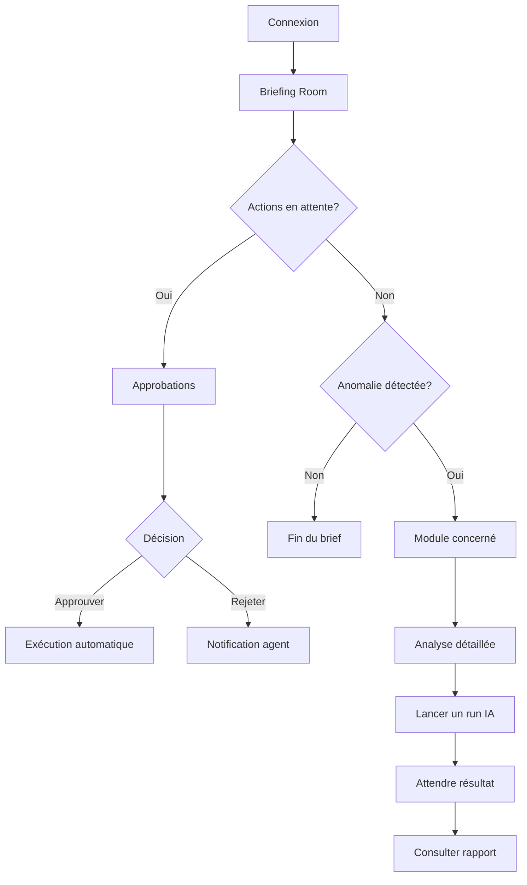

# User Stories — HQ EMOTIONSCARE

> Documentation UX : Scénarios d'utilisation du Siège Social Numérique

---

## 🎯 Persona Principal : La Présidente

**Profil** : Présidente d'EMOTIONSCARE SASU, non-technique, supervise 5 plateformes SaaS.

**Objectif** : Piloter l'entreprise sans jamais manipuler GitHub, Supabase ou du code.

**Besoin clé** : "Je veux voir, décider, valider — pas exécuter."

---

## 📋 User Stories par Module

### 1. Briefing Room (Dashboard Exécutif)

#### US-001 : Consulter le brief quotidien
```
En tant que Présidente,
Je veux voir un résumé exécutif de l'état de mes 5 plateformes
Afin de commencer ma journée informée en moins de 2 minutes.
```

**Critères d'acceptation :**
- [ ] Afficher les KPIs clés (MRR, churn, tickets ouverts, uptime)
- [ ] Indicateurs visuels rouge/orange/vert pour chaque métrique
- [ ] Dernière mise à jour horodatée
- [ ] Actions recommandées par l'IA si anomalies détectées

**Scénario :**
1. La Présidente ouvre le HQ à 9h00
2. Le Briefing Room affiche : "MRR : 12 450€ (+8.2%)", "Uptime 99.9%", "3 tickets critiques"
3. L'IA suggère : "Priorité recommandée : Traiter les 3 tickets Support avant 12h"
4. La Présidente clique sur "Voir les tickets" → Redirection vers Support

---

### 2. Approbations

#### US-002 : Valider une campagne marketing
```
En tant que Présidente,
Je veux approuver ou rejeter les actions proposées par les agents IA
Afin de garder le contrôle sur les décisions critiques.
```

**Critères d'acceptation :**
- [ ] Liste des actions en attente avec niveau de risque (bas/moyen/élevé)
- [ ] Détail de l'action proposée (description, impact, coût estimé)
- [ ] Boutons "Approuver" et "Rejeter" avec champ de commentaire optionnel
- [ ] Historique des décisions passées

**Scénario :**
1. L'agent IA Marketing propose une campagne email pour 500 contacts
2. L'action apparaît dans Approbations avec niveau "Moyen"
3. La Présidente lit le résumé : "Campagne promo -20% pour les étudiants en médecine"
4. Elle clique "Approuver" avec le commentaire "OK, lancer ce week-end"
5. L'action est exécutée automatiquement par l'agent IA

---

### 3. Finance & ROI

#### US-003 : Suivre les revenus Stripe
```
En tant que Présidente,
Je veux voir mes revenus en temps réel depuis Stripe
Afin de suivre la santé financière de l'entreprise.
```

**Critères d'acceptation :**
- [ ] MRR (Monthly Recurring Revenue) avec variation vs mois précédent
- [ ] Nombre d'abonnements actifs et nouveaux clients
- [ ] Taux de churn mensuel
- [ ] Répartition par plateforme si disponible

**Scénario :**
1. La Présidente accède à Finance > ROI
2. Elle voit : "MRR : 12 450€ (+8.2% vs octobre)"
3. Graphique de progression sur les 6 derniers mois
4. Badge "Stripe connecté ✓" confirme les données réelles

---

### 4. Équipe Exécutive (Agents IA)

#### US-004 : Lancer un brief exécutif hebdomadaire
```
En tant que Présidente,
Je veux demander à mon agent CEO de générer un rapport hebdo
Afin de partager une synthèse avec mes investisseurs.
```

**Critères d'acceptation :**
- [ ] Liste des 21 agents IA avec leur rôle et statut (actif/inactif)
- [ ] Bouton "Lancer une action" pour chaque agent
- [ ] Sélection du type de run (Brief, Analyse, Veille)
- [ ] Notification quand le run est terminé

**Scénario :**
1. La Présidente clique sur l'agent "CEO - Directrice Générale"
2. Elle sélectionne "Brief Exécutif Hebdomadaire"
3. Le système lance le run et affiche la progression
4. 30 secondes plus tard, notification : "Brief prêt — Ouvrir le rapport"

---

### 5. Support

#### US-005 : Voir les tickets critiques
```
En tant que Présidente,
Je veux voir les tickets support urgents
Afin de m'assurer que les problèmes clients sont traités rapidement.
```

**Critères d'acceptation :**
- [ ] Nombre de tickets ouverts par priorité (critique/haute/moyenne/basse)
- [ ] Temps de réponse moyen
- [ ] Taux de résolution
- [ ] Liste des tickets critiques avec description courte

**Scénario :**
1. La Présidente voit "3 tickets critiques" dans le Briefing Room
2. Elle clique et accède à Support
3. Elle voit : "Ticket #127 - EmotionsCare - Login impossible - 2h sans réponse"
4. Elle peut assigner le ticket à un agent ou escalader

---

### 6. Plateformes

#### US-006 : Vérifier le statut des 5 plateformes
```
En tant que Présidente,
Je veux voir l'état de chaque plateforme en un coup d'œil
Afin de m'assurer que tout fonctionne correctement.
```

**Critères d'acceptation :**
- [ ] Liste des 5 plateformes avec statut (Production/Prototype/Maintenance)
- [ ] Uptime des dernières 24h
- [ ] Dernière activité GitHub (commits, PRs)
- [ ] Lien vers chaque plateforme déployée

**Scénario :**
1. La Présidente accède à Plateformes
2. Elle voit : "EmotionsCare ✓ Production | Uptime 99.9% | 3 commits aujourd'hui"
3. "Pixel Perfect Replica ⚠️ Prototype | En développement"
4. Elle clique sur EmotionsCare pour accéder au détail

---

## 🔐 Rôles et Permissions

| Rôle | Modules accessibles | Actions possibles |
|------|---------------------|-------------------|
| **Owner** | Tous | Tout |
| **Admin** | Tous | Tout sauf supprimer |
| **Finance** | Dashboard, Finance, Runs, Plateformes, Audit | Vue + Création runs |
| **Marketing** | Dashboard, Marketing, Runs, Plateformes | Vue + Création runs |
| **Support** | Dashboard, Support, Runs, Plateformes | Vue |
| **Product** | Dashboard, Produit, Runs, Plateformes | Vue + Édition |
| **Engineering** | Dashboard, Engineering, Runs, Plateformes, Diagnostics, Audit | Vue + Création + Édition |
| **Viewer** | Dashboard, Plateformes, Runs | Vue seule |

---

## 🎨 Parcours Utilisateur Type



---

## 📱 Responsive Design

| Écran | Priorité | Comportement |
|-------|----------|--------------|
| Desktop (>1024px) | Principale | Sidebar permanente, dashboard complet |
| Tablet (768-1024px) | Secondaire | Sidebar rétractable, cartes empilées |
| Mobile (<768px) | Tertiaire | Navigation bottom bar, KPIs essentiels |

---

## 🔔 Notifications

| Événement | Canal | Priorité |
|-----------|-------|----------|
| Run terminé | Toast + Badge | Normale |
| Approbation requise | Toast + Email (optionnel) | Haute |
| Anomalie détectée | Toast + Badge rouge | Critique |
| Nouveau ticket critique | Toast + Email | Critique |

---

## 📊 Métriques de Succès

| Métrique | Objectif | Mesure |
|----------|----------|--------|
| Temps de brief quotidien | < 2 min | Analytics page view |
| Taux d'approbation | > 80% | Compteur approvals |
| Détection anomalies | < 5 min | Timestamp alerte vs incident |
| Satisfaction Présidente | > 4.5/5 | Survey trimestriel |

---

*Document créé le 03/02/2026 — Version 1.0*
